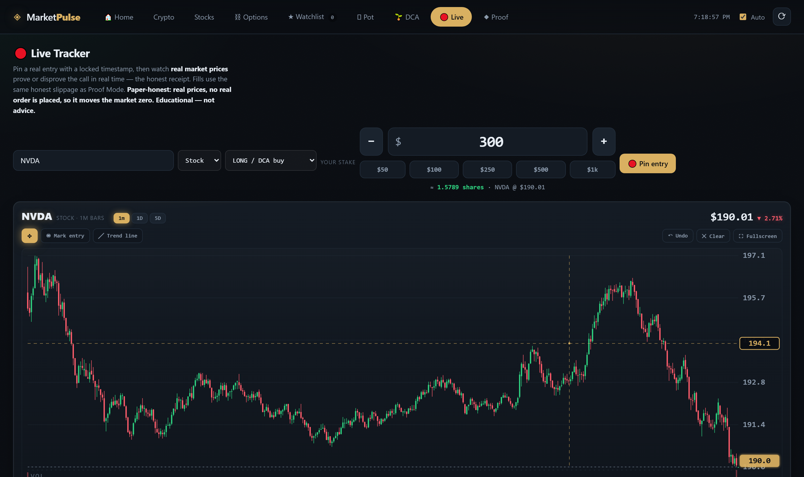
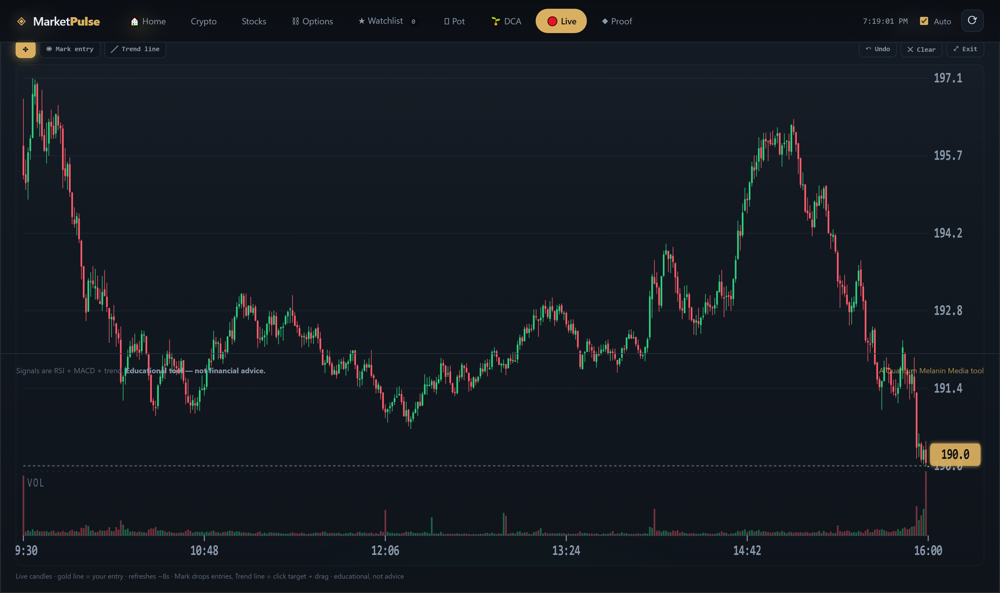

# MarketPulse — "MAPLE58"

**An honest options-research dashboard. Live prices, real signals, no upsell.**

**[▶ Try it live at marketpulse-22bi.onrender.com](https://marketpulse-22bi.onrender.com/)**

---

MarketPulse pulls live market data, reads the technicals, and walks you through
one question: *what's a play I can actually afford, and how do I lose small when
I'm wrong?*

Two ways to run it:

- **Just use it →** hit **[marketpulse-22bi.onrender.com](https://marketpulse-22bi.onrender.com/)**
- **Run it locally →** one command, no account, no API key, no data leaves your machine.

> **MAPLE58 = MArket PuLsE.** Brand rule: it will **not** lie to you about
> getting rich. Most options trades lose — *survival* is the real skill.

---

## 🔴 Live Trading Chart *(the new hotness)*

The **Live** tab is a hand-rolled SVG chart tuned for actually working a trade:

- **1-minute intraday tape** for stocks (Yahoo) and crypto (Coinbase), auto-refreshes every ~8 seconds
- **Webull-style layout** — right-side price ladder with a floating gold last-price tag, bottom time axis, volume histogram
- **Snap-to-candle precision pointer** — the cursor magnetically locks to a candle's `HIGH` / `LOW` / `OPEN` / `CLOSE` within ~18 physical pixels. Color-coded reticle tells you which point you're grabbing. Hold `Alt` to bypass.
- **Draw your own trend lines** — click the target price, then press-and-drag anywhere on the chart to rubber-band a gold trend line to the release point. Both endpoints snap to candle wicks.
- **Mark potential entries** with a single click; each mark is saved per-symbol in your browser
- **Edit anything you've drawn** — hover any mark or trend endpoint → cursor becomes a grab hand → drag to move (still snaps). `Alt+click` to delete.
- **Fullscreen mode** with a smooth View Transitions morph (`⛶` button or `Esc` to exit)
- **Persistence** — marks and trend lines are stored per-symbol as `(timestamp, price)` in `localStorage`, so switching timeframes doesn't misalign them

*Fullscreen mode: crosshair + price ladder + volume + time axis, Webull-style.*

---

## Quick start (run it locally)

You need **Python 3** installed. That's it.

- **Windows:** double-click **`run.bat`**
- **Mac / Linux:** run **`bash run.sh`**

It opens **http://127.0.0.1:8000** in your browser automatically.
To stop it, close the terminal window (or press `Ctrl+C`).

### Windows: don't have Python?
If `run.bat` flashes open and closes, you don't have Python yet. Install it once:

1. Go to **https://www.python.org/downloads/** and install Python 3.
2. **Important:** on the first installer screen, check **"Add Python to PATH."**
3. Re-run `run.bat`.

That's the only setup. Everything else is built in — no `pip install`, no extra
downloads.

---

## What you get — the four jobs: GET · KEEP · GROW · SHARE

**GET — find a play you can afford.**
A plain-English *direction nudge* (a lean, never an order — the choice is yours),
the TTM squeeze, an expected-move read, and a scanner for volatile, low-dollar
names you can actually trade.

**KEEP — be wrong cheaply.**
The *probe*: the smallest first bet that still tells you something. A delta-based
readability floor so you're not buying dead lottery tickets, prices shown in
**real per-contract dollars** (premium × 100), and a 20%-of-pot rule that says
*walk* when a play is too rich.

**GROW — escalate only your winners.**
Probe → Read → Escalate, tracked in the **Pot Tracker** (e.g. $300 → $333).
Never revenge-size.

**SHARE — prove it, don't sell hype.**
**Proof Mode** backtests the exact signal over years and shows the **losses** too,
not just the wins. Plus a built-in glossary so every number on screen has a plain
definition. The tool stays honest.

### The Options tab reads top-to-bottom like a funnel
**Nudge** (which way it leans) → **Strategy card** (the structure + $/contract) →
**Probe plan** (smallest readable bet) → **The Read** (6-step: trend · coil ·
signal · volatility · the play · the catch) → **Glossary** → full **chain** with
IV + Greeks in per-contract dollars.

---

## Where the data comes from
- **Options chains, IV & Greeks:** CBOE free delayed quotes (no key).
- **Stocks:** Yahoo Finance chart API (no key).
- **Crypto:** CoinGecko public API + Coinbase public candles (no key).

The included Python server fetches this for you (so the browser never hits a CORS
wall) and caches responses to stay within free limits. Data is delayed (~15 min
for options) — this is a research tool, not a live trading terminal.

---

## Under the hood

- **Backend:** pure Python **standard library** HTTP server (`app.py`). No Flask, no requests, no `pip install`. Just Python 3.
- **Frontend:** vanilla JavaScript + hand-rolled SVG charts. No React, no chart library. Fast to load, easy to hack.
- **State:** browser `localStorage` — your Pot, your Live pins, your marks and trend lines never leave your machine.
- **Deploy:** auto-deploys from `main` to Render on push.

---

## Folders
- **`/` + `static/`** — the dashboard (this is what `run.bat` / `run.sh` launches).
- **`agent/`** *(optional, advanced)* — a **paper-first, propose-and-approve**
  trading layer for Alpaca's free paper account. It never auto-fires real money;
  a human approves every order, behind independent safety guardrails (spend caps,
  kill switch, slippage gate, circuit breaker). See `agent/README.md`.
- **`tests/`** — the automated test suite for the math and the safety gates.
  Run `python -m pytest` if you have pytest. (You don't need this to use the app.)

---

## Important
This is an **educational tool, not financial advice.** Technical signals describe
what price *has done*, not what it *will do*. **Most options trades lose — that's
the math, and this tool is built to keep you alive long enough to learn.** Trade
your own research; never risk money you can't afford to lose. Slow and alive beats
fast and liquidated.

---

*A [**Quantum Melanin Media**](https://marketpulse-22bi.onrender.com/) tool.*

